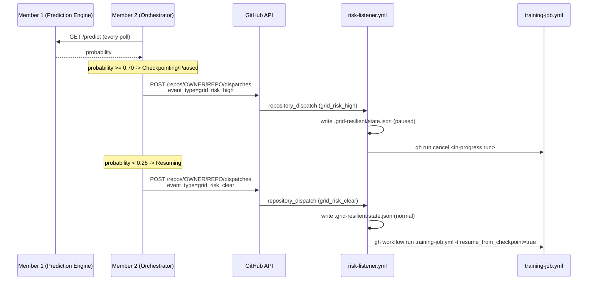

# Member 4 — CI/CD Pipeline Integration

Connects the Orchestrator's (Member 2) decisions to a real GitHub Actions
pipeline: pauses the protected job when outage risk is high, resumes it
automatically once risk clears.

## How it fits together



## Files

| File | Purpose |
|---|---|
| `.github/workflows/training-job.yml` | The protected job (stand-in for Member 3's real training loop). Refuses to start a fresh run while risk is `paused`; supports `resume_from_checkpoint`. |
| `.github/workflows/risk-listener.yml` | Listens for `grid_risk_high` / `grid_risk_clear` dispatches, updates `.grid-resilient/state.json`, cancels/re-triggers the training job. |
| `scripts/simulate_outage.sh` | Fires the same dispatch events manually — for testing and the live demo, without needing Member 2's orchestrator running. |

## Setup — run this on your machine

### 1. Push these files to the hackathon GitHub repo

```bash
# from inside the repo root
mkdir -p .github/workflows scripts
# copy training-job.yml and risk-listener.yml into .github/workflows/
# copy simulate_outage.sh into scripts/
chmod +x scripts/simulate_outage.sh

git add .github scripts
git commit -m "Member 4: CI/CD pause/resume integration"
git push
```

### 2. Create a Personal Access Token (PAT)

The listener workflow uses the built-in `GITHUB_TOKEN` (already available
inside Actions, no setup needed). But **triggering** a dispatch from
*outside* Actions — i.e. from Member 2's Orchestrator running on someone's
laptop, or from `simulate_outage.sh` — needs a separate PAT:

1. GitHub → Settings → Developer settings → Personal access tokens →
   Tokens (classic) → Generate new token.
2. Scope: `repo` (full control of the repo — needed for dispatches).
3. Copy the token once, you won't see it again.

### 3. Point Member 2's Orchestrator at your repo

```bash
export GITHUB_REPO="your-org/your-repo"
export GITHUB_TOKEN="ghp_xxxxxxxxxxxx"
```

These are the exact env vars `orchestrator/config.py` already reads — no
code changes needed on either side.

### 4. Test your integration in isolation (before Member 2 is wired in)

```bash
cd scripts
GITHUB_REPO="your-org/your-repo" GITHUB_TOKEN="ghp_xxxxxxxxxxxx" ./simulate_outage.sh high
```

Then check the **Actions** tab on GitHub:
- "Grid Risk Listener" should have run.
- `.grid-resilient/state.json` in the repo should now say `"status": "paused"`.

Now manually run "Protected Training Job" from the Actions tab → it should
fail immediately with "Grid risk is currently HIGH".

Clear the risk and confirm auto-resume:

```bash
./simulate_outage.sh clear
```

- "Grid Risk Listener" runs again, sets state back to `normal`, and
  automatically re-triggers "Protected Training Job" with
  `resume_from_checkpoint=true`.

### 5. Full end-to-end test (with the real Orchestrator)

```bash
cd member2_orchestrator
pip install -r requirements.txt
export PREDICTION_ENGINE_URL="http://localhost:8000/predict"
export GITHUB_REPO="your-org/your-repo"
export GITHUB_TOKEN="ghp_xxxxxxxxxxxx"
python demo.py --live
```

1. Manually trigger "Protected Training Job" from the Actions tab so a run
   is in progress.
2. Let the orchestrator's probability spike past 0.70 (or use Member 1's
   `/predict` with a maintenance-window date/time from
   `maintenance_calendar.json` to force it).
3. Watch the run get cancelled automatically, then resumed once probability
   drops back below 0.25.

## Known limitations (documented honestly, for the pitch)

- "Pausing" a GitHub Actions run isn't a true pause — it's a **cancel +
  re-trigger**. True mid-run pausing isn't supported by Actions; the resume
  only works because Member 3's checkpoint makes re-starting from the last
  saved step equivalent to resuming.
- The listener commits `.grid-resilient/state.json` straight to the default
  branch. Fine for a hackathon demo; a production version would use a
  repository *variable* or an external store instead of a commit per event.
- `training-job.yml`'s actual workload is a placeholder loop — swap the
  "Run the protected job" step for Member 3's real training script before
  the demo.
