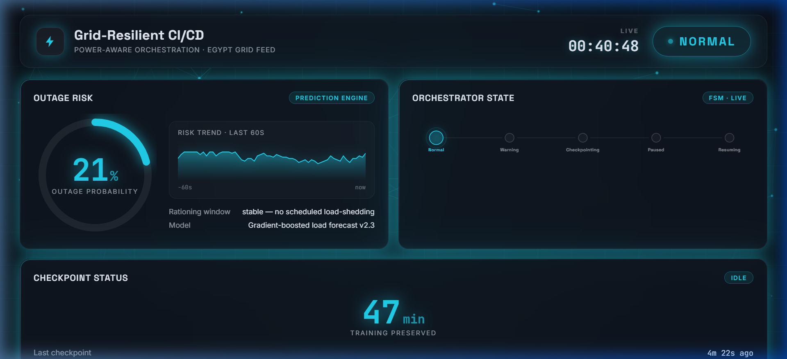
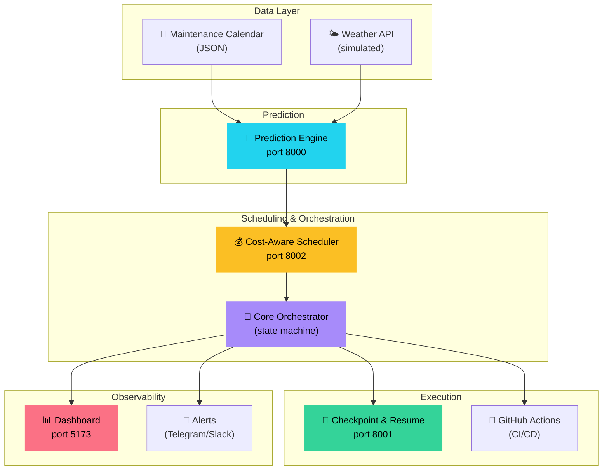
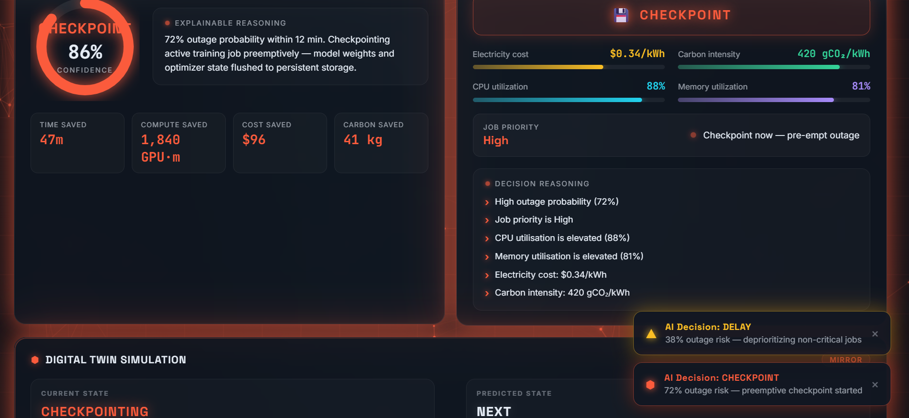
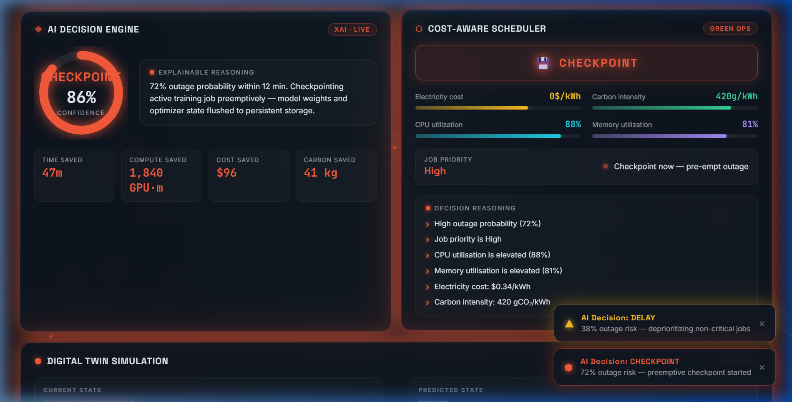
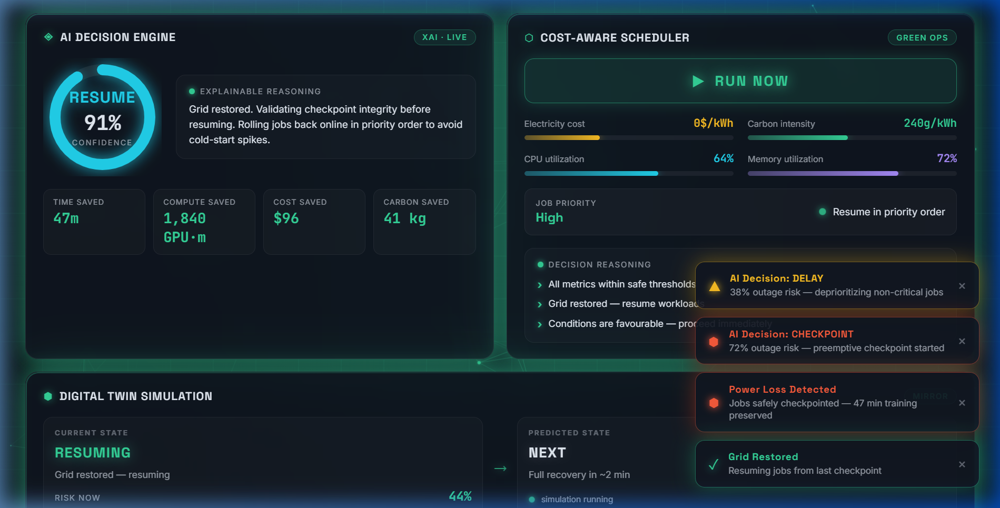
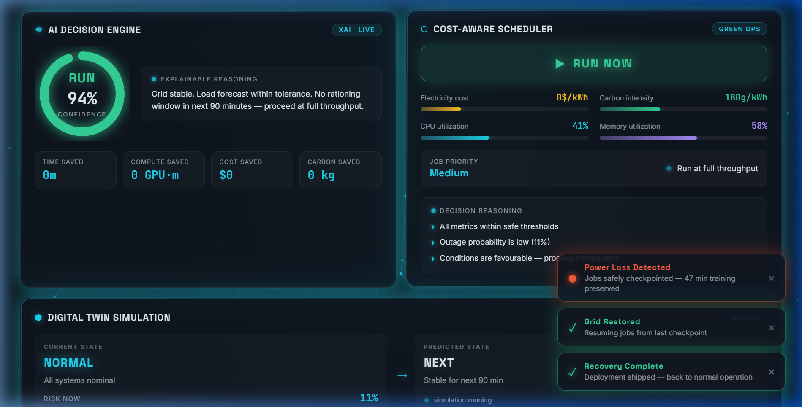
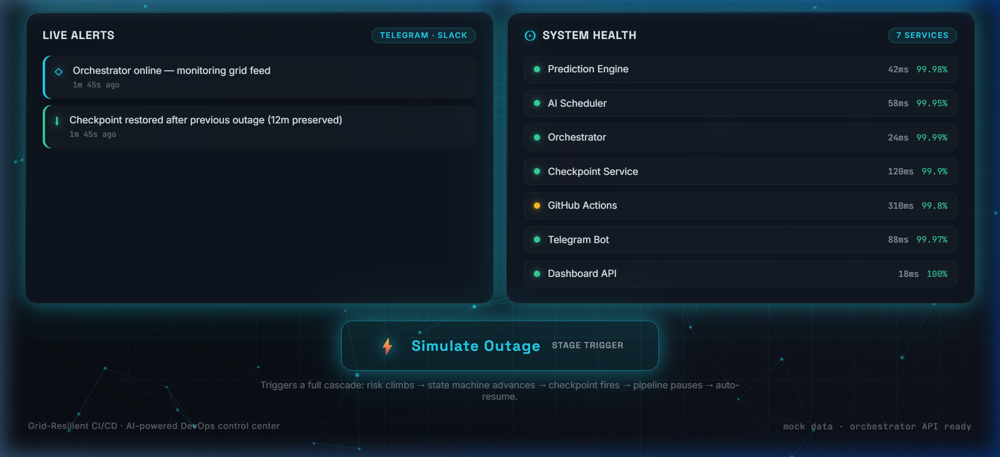

<p align="center">
  
</p>

<h1 align="center">⚡ Grid-Resilient CI/CD</h1>

<p align="center">
  <strong>Power-aware orchestration for AI/ML pipelines in unstable grid environments</strong>
</p>

<p align="center">
  
  
  
  
  
</p>

<p align="center">
  <em>Predicts upcoming power outages, automatically checkpoints running workloads,<br/>
  pauses deployments, optimises scheduling by cost & carbon, and resumes after power returns.</em>
</p>

---

## 🎯 Problem

In regions with unstable power grids (load-shedding, scheduled maintenance, unexpected outages), long-running AI/ML training jobs and CI/CD deployments are vulnerable to interruption. A single power cut can waste hours of GPU compute, corrupt model checkpoints, and leave deployments in a broken state.

**Grid-Resilient CI/CD** solves this by building power-awareness directly into the DevOps pipeline — predicting outages before they happen, and automatically protecting workloads.

## 🏗️ Architecture



## ✨ Key Features

### 🔮 Outage Prediction Engine
- Gradient-boosted ML model trained on historical grid data
- Integrates scheduled maintenance calendar + weather signals
- Returns real-time outage probability (0–100%) per region

### 🧠 Core Orchestrator
- 5-state finite state machine: **Normal → Warning → Checkpointing → Paused → Resuming**
- Hysteresis dead-band prevents state flapping under oscillating probabilities
- Emits structured JSON events on every tick for full observability

### 💰 Cost-Aware Scheduler *(NEW)*
Optimises pipeline execution timing based on **6 factors**:

| Factor | Source |
|--------|--------|
| Outage probability | Prediction Engine |
| CPU utilisation | System metrics (simulated) |
| Memory utilisation | System metrics (simulated) |
| Electricity cost | Grid pricing (simulated) |
| Carbon intensity | Grid carbon data (simulated) |
| Job priority | Pipeline configuration |

**Outputs one of 4 decisions** with full reasoning chain:

| Decision | When |
|----------|------|
| `RUN_NOW` | All conditions favourable |
| `DELAY` | Moderate risk, high cost, or low-priority job |
| `CHECKPOINT` | High outage risk + critical job |
| `PAUSE` | Extreme outage probability (≥90%) |

### 💾 Checkpoint & Resume
- Pre-emptive checkpointing of ML training state (model weights, optimizer, epoch)
- Automatic resume from last checkpoint after grid restoration
- Zero wasted compute — pick up exactly where you left off

### 🔄 GitHub Actions Integration
- `repository_dispatch` events pause/resume protected workflows
- State file (`.grid-resilient/state.json`) gates job execution
- Training jobs refuse to start while grid risk is elevated

### 📊 Real-Time Dashboard

<details>
<summary><strong>🖼️ Dashboard Screenshots (click to expand)</strong></summary>

#### Normal Operation — All Systems Go


#### Checkpointing — Pre-empting Outage  


#### Paused — Power Loss Detected


#### Resuming — Grid Restored


#### System Health & Alerts


</details>

The dashboard features:
- **Live outage risk gauge** with 60-second trend sparkline
- **State machine visualisation** showing current orchestrator state
- **Cost-Aware Scheduler panel** — decision badge, metric gauges, reasoning chain
- **AI Decision Engine** with explainable reasoning
- **Digital Twin simulation** showing predicted vs. actual state
- **Pipeline timeline** tracking CI/CD stage progression
- **System health** monitor for all 7 services
- **Toast notifications** for real-time alerts
- **One-click "Simulate Outage"** button for full end-to-end demo

## 📁 Project Structure

```
grid-resilient-cicd/
├── member1_prediction_engine/     # 🔮 Outage Prediction Engine (port 8000)
│   ├── app.py                     #    FastAPI service
│   ├── prediction_model.pkl       #    Trained gradient-boosted model
│   ├── maintenance_calendar.json  #    Scheduled outage data
│   └── requirements.txt
│
├── member2_orchestrator/          # 🧠 Core Orchestrator
│   ├── orchestrator/
│   │   ├── state_machine.py       #    Pure decide() function + 5 states
│   │   ├── core.py                #    Orchestrator class + scheduler integration
│   │   ├── config.py              #    All tunable values
│   │   ├── interfaces.py          #    Service adapters (with mock fallbacks)
│   │   └── logging_setup.py
│   ├── tests/                     #    17 unit tests + stress test
│   ├── demo.py                    #    Standalone & live demo modes
│   └── requirements.txt
│
├── cost_aware_scheduler/          # 💰 Cost-Aware Scheduler (port 8002)
│   ├── models.py                  #    SchedulerInput, SchedulerDecision, enums
│   ├── scheduler.py               #    CostAwareScheduler — rule-chain engine
│   ├── simulators.py              #    Time-varying metric simulators
│   ├── api.py                     #    FastAPI service
│   ├── tests/                     #    13 unit tests
│   └── requirements.txt
│
├── member3_checkpointing_starter/ # 💾 Checkpoint & Resume (port 8001)
│   ├── app.py                     #    FastAPI service with PyTorch checkpoint
│   ├── MEMBER3_INTERFACE_SPEC.md  #    Integration contract
│   └── requirements.txt
│
├── .github/workflows/             # 🔄 GitHub Actions CI/CD
│   ├── training-job.yml           #    Protected training pipeline
│   └── risk-listener.yml          #    Dispatch event handler
│
├── ui/                            # 📊 Dashboard (port 5173)
│   ├── src/
│   │   ├── App.jsx                #    Main layout — 19 components
│   │   ├── App.css                #    900+ lines of custom styling
│   │   ├── hooks/useSystemState.js #   State management + simulation
│   │   ├── lib/theme.js           #    Theming engine
│   │   └── components/            #    19 React components
│   └── package.json
│
├── docs/screenshots/              # 🖼️ Dashboard screenshots
└── README.md                      # 📖 You are here
```

## 🚀 Quick Start

### Prerequisites

- **Python 3.11+** with pip
- **Node.js 18+** with npm
- `scikit-learn==1.6.1` (critical — the model was saved with this exact version)

### 1. Clone & Install

```bash
git clone https://github.com/your-org/grid-resilient-cicd.git
cd grid-resilient-cicd

# Backend dependencies
pip install -r member1_prediction_engine/requirements.txt
pip install -r member2_orchestrator/requirements.txt
pip install -r cost_aware_scheduler/requirements.txt

# Frontend dependencies
cd ui && npm install && cd ..
```

### 2. Start All Services

Open 4 terminals:

**Terminal 1 — Prediction Engine (port 8000):**
```bash
cd member1_prediction_engine
uvicorn app:app --port 8000
```

**Terminal 2 — Checkpoint Service (port 8001):**
```bash
cd member3_checkpointing_starter
uvicorn app:app --port 8001
```

**Terminal 3 — Cost-Aware Scheduler (port 8002):**
```bash
cd cost_aware_scheduler
uvicorn api:app --port 8002
```

**Terminal 4 — Dashboard (port 5173):**
```bash
cd ui
npm run dev
```

Then open **http://localhost:5173** and click **"Simulate Outage"** to watch the full cascade.

### 3. Run the Orchestrator (optional — for real polling)

```bash
cd member2_orchestrator
export PREDICTION_ENGINE_URL="http://localhost:8000/predict"
export CHECKPOINT_SERVICE_URL="http://localhost:8001/checkpoint"
export RESUME_SERVICE_URL="http://localhost:8001/resume"
python demo.py --live
```

## 🧪 Testing

```bash
# Orchestrator — 17 tests including 5000-tick stress test
cd member2_orchestrator && python -m pytest tests/ -v

# Cost-Aware Scheduler — 13 tests covering full decision matrix
python -m pytest cost_aware_scheduler/tests/ -v

# Checkpoint service
cd member3_checkpointing_starter && python -m pytest test_app.py -v
```

## ⚙️ Configuration

All services are configured via environment variables:

| Variable | Default | Description |
|----------|---------|-------------|
| `PREDICTION_ENGINE_URL` | *(mock fallback)* | Member 1 API URL |
| `CHECKPOINT_SERVICE_URL` | *(mock fallback)* | Member 3 checkpoint endpoint |
| `RESUME_SERVICE_URL` | *(mock fallback)* | Member 3 resume endpoint |
| `SCHEDULER_SERVICE_URL` | *(built-in)* | Cost-Aware Scheduler API |
| `SCHEDULER_DEFAULT_PRIORITY` | `Medium` | Default job priority (High/Medium/Low) |
| `GITHUB_REPO` | *(mock fallback)* | GitHub repo for CI/CD dispatch |
| `GITHUB_TOKEN` | *(mock fallback)* | GitHub PAT with `repo` scope |
| `ORCH_POLL_INTERVAL` | `15` | Seconds between polling cycles |
| `ORCH_EVENT_LOG_PATH` | `orchestrator_events.jsonl` | Structured event log output |

## 🔌 API Reference

### Prediction Engine — `http://localhost:8000`

| Endpoint | Method | Description |
|----------|--------|-------------|
| `/predict` | GET | Returns `{ probability, region, model_version }` |
| `/health` | GET | Service health check |

### Cost-Aware Scheduler — `http://localhost:8002`

| Endpoint | Method | Description |
|----------|--------|-------------|
| `/schedule` | POST | Evaluate scheduling decision with custom inputs |
| `/schedule` | GET | Auto-evaluate using simulated metrics + prediction engine |
| `/metrics` | GET | Current simulated resource/cost metrics |
| `/health` | GET | Service health check |

### Checkpoint Service — `http://localhost:8001`

| Endpoint | Method | Description |
|----------|--------|-------------|
| `/checkpoint` | POST | Save current training state |
| `/resume` | POST | Resume from last checkpoint |

## 🛡️ Design Principles

- **Zero existing code broken** — the Cost-Aware Scheduler is a new module that plugs into the orchestrator without modifying the existing state machine logic
- **Graceful degradation** — every service adapter has a mock fallback; any service can be down and the system continues
- **SOLID architecture** — single responsibility per module, open for extension (new scheduling rules without modifying existing ones)
- **Hysteresis prevents flapping** — different thresholds for entering vs. leaving states prevents rapid oscillation under noisy data
- **Explainable decisions** — every scheduling decision includes a full reasoning chain, not just the action

## 📊 Decision Flow Example

```
Input:
  outage_probability: 0.72
  cpu_percent: 88%
  memory_percent: 81%
  electricity_cost: $0.34/kWh
  carbon_intensity: 420 gCO₂/kWh
  job_priority: High

Output:
  decision: CHECKPOINT
  reasons:
    › High outage probability (72%)
    › Job priority is High
    › CPU utilisation is elevated (88%)
    › Memory utilisation is elevated (81%)
    › Electricity cost: $0.34/kWh
    › Carbon intensity: 420 gCO₂/kWh
```

## 👥 Team


| 👤 Name | 💻 GitHub | 🔗 LinkedIn |
|---------|----------|------------|
| Aya Sayed | [GitHub](https://github.com/14930) | [LinkedIn](https://www.linkedin.com/in/aya-sayed-bb6a80397) |
| Maryam Moustafa | [GitHub](https://github.com/maryam305) | [LinkedIn](https://www.linkedin.com/in/maryam-moustafa-653257378) |
| Malak Mohamed | [GitHub](https://github.com/malakmohamedrefaat) | [LinkedIn](https://www.linkedin.com/in/malak-mohamed-24b605264/) |
| Alaa Sayed | [GitHub](https://github.com/engyelsarta) | [LinkedIn](https://www.linkedin.com/in/engy-elsarta-6a6a06283)
| Salma  | [GitHub](https://github.com/mazenElzeiny) | [LinkedIn](https://www.linkedin.com/in/mazenelzeiny) |
## 📄 License

MIT License — see [LICENSE](LICENSE) for details.
